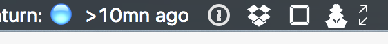

#Jenkins bitbar

A [bitbar](https://github.com/matryer/bitbar#get-started) plugin to display jenkins status.

## How to use

1. Download bitbar from [here](https://github.com/matryer/bitbar/releases).
2. Set bitbar folder to `script`.
3. In the [script](./script/jenkins-multiple-projects-status.1m.sh), you can set the `BASE_URL` to your jenkins website and the `PROJECTS` your want to observe. 
4. Then it will fetch the task status per minutes and update the icon in your task menu.

